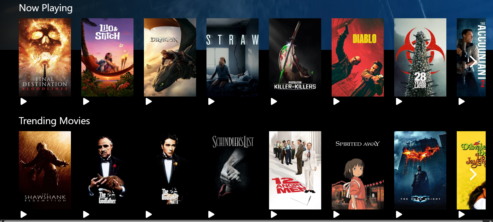

# 🎬 Netflix Clone – Movie Trailer Web App

A Netflix-inspired web application where users can discover and watch trailers for the latest, trending, upcoming, and popular movies. Built with a sleek dark UI that mimics the Netflix experience.


## 🌐 Live Demo

Check out the live demo of the app [here](https://netflix-clone-app-five.vercel.app/).

## 🚀 Features

### 🔐 Authentication

- **User Login** with secure session handling
- Protected routes for personalized experience

### 🎞️ Movie Categories

- **Now Playing** – Movies currently in theatres
- **Trending Movies** – Most viewed movies worldwide
- **Upcoming Movies** – Titles releasing soon
- **Popular Movies** – Fan-favorites and highly rated picks

### 🎥 Watch Trailers

- Click on any movie card to **watch its trailer** instantly via YouTube integration

### 🧭 Netflix-like UI

- Horizontal carousels for movie categories
- Smooth transitions and trailer popups
- Responsive layout with mobile support



## 🧑‍💻 Tech Stack

- **Frontend:** React.js, Tailwind CSS
- **Routing:** React Router DOM
- **Authentication:** Firebase Auth / JWT (optional)
- **API:** TMDB (The Movie Database) API
- **Video Playback:** YouTube Iframe Player API

## 📦 Project Setup

```bash
# 1. Clone the repository
git clone https://github.com/your-username/netflix-clone.git
cd netflix-clone

# 2. Install dependencies
npm install
```
